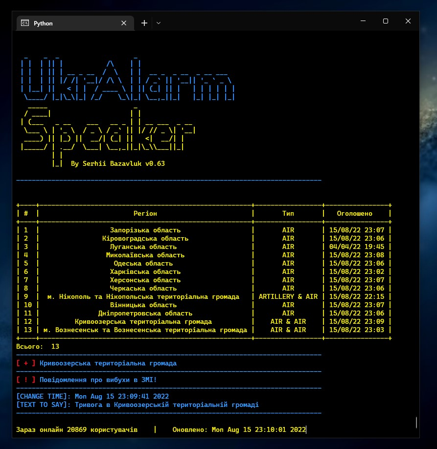

# UkrAlarmSpeaker
Додаток до офіційної карти повітряних тривог України https://map.ukrainealarm.com/

Що робить:
1. Говорить голосом про початоки та відміни тривог по Україні.
2. Говорить про повідомлення вибухів в ЗМІ
3. Показує список регіонів де тривога та тип тривоги (UNKNOWN, AIR, ARTILLERY, URBAN_FIGHTS, CHEMICAL, NUCLEAR, INFO)
4. Працює на websocket тому затримки мінімальні (менше секунди).
5. Показує скільки людей зараз переглядає карту (користувачі онлайн).

Отримує дані з https://map.ukrainealarm.com/ та 'wss://ws.ukrainealarm.com' через websocket

Написано на Python

Працює на Windows (просто запустити файл)

Have fun!

# Stay safe!

